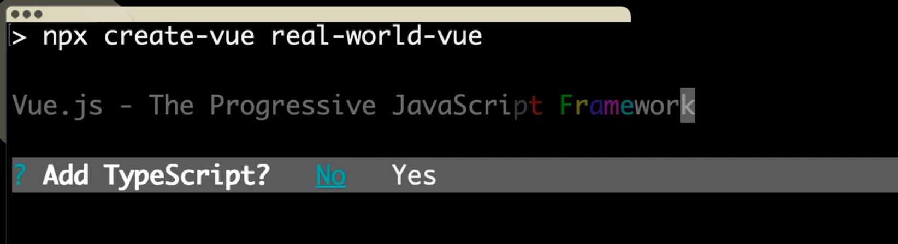
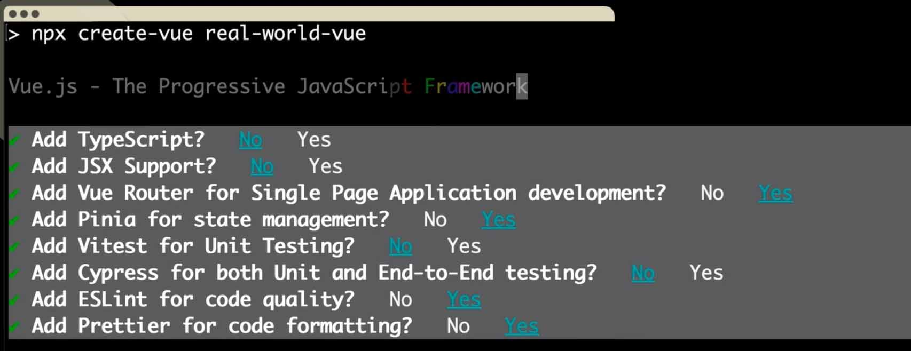
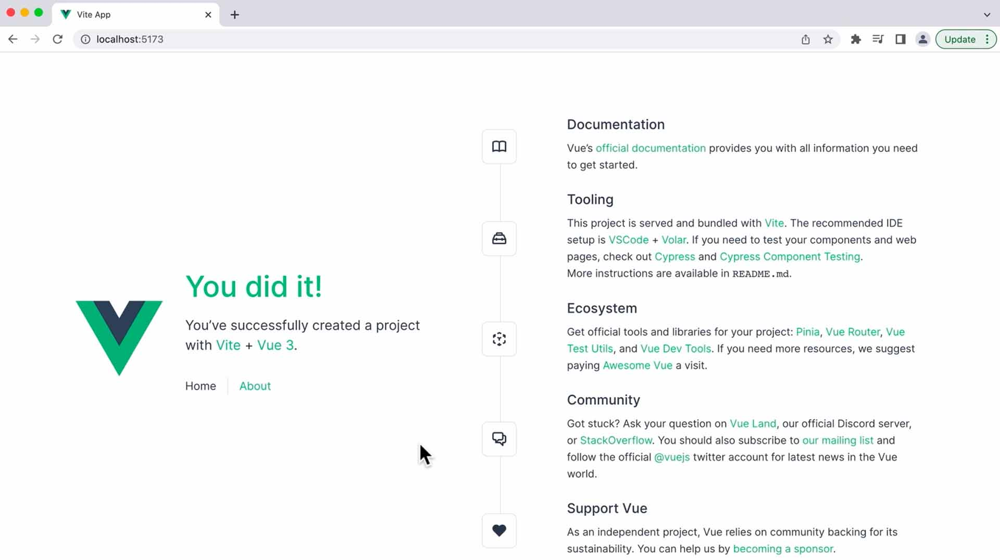
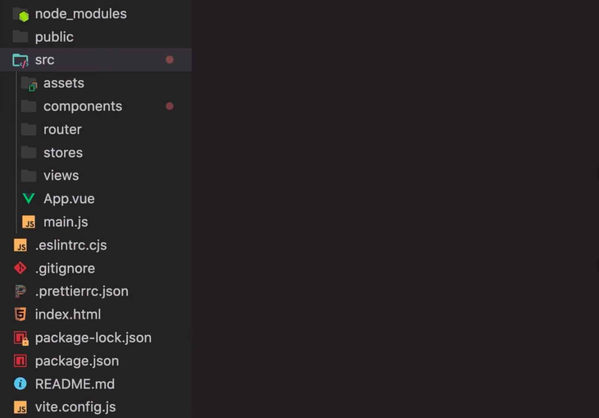
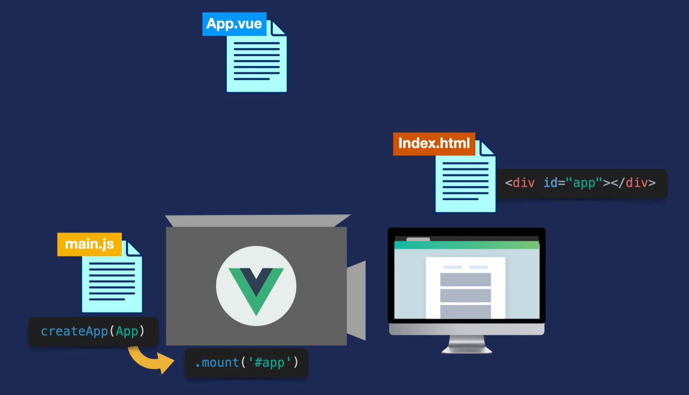

# **2. Real World Vue.JS3 (API de Composição)**

## **Este repositório possui um curso sobre a construção de uma _app_ Vue.JS 3**

Neste curso, criaremos um aplicativo de nível de produção usando Vue.JS versão 3. Começaremos criando o projeto usando o comando ``create-vue``. Em seguida, aprenderemos sobre componentes ``.vue`` e como eles podem ser usados para criar um aplicativo de página única (**Single Page Application**). Depois abordaremos os fundamentos do "**Vue Router**" para que possamos navegar entre as diferentes visualizações de nosso aplicativo e até mesmo buscar dados externos reais usando chamadas de API com o "**Axios**". Terminaremos aprendendo sobre o processo de construção e como implantar nosso aplicativo em produção.

## **IDE recomendado**

Vai-se utilizar o VSCode. Caso você ainda não o tenha [baixe-o](https://code.visualstudio.com/download), e depois instale-o.

Instale, também uma extensão do VSCode chamada [es6-string.html](https://marketplace.visualstudio.com/items?itemName=Tobermory.es6-string-html)


## **Tutorial 2. Criando o Projeto (comando create-vue)**

Neste tutorial, vamos criar nosso projeto usando o comando ``create-vue``, que é uma ferramenta CLI (_Command Line Interface_) baseada em uma ferramenta de compilação chamada _Vite.js_. Faremos um "tour" pelo projeto que a CLI gera para nos sentirmos confortáveis trabalhando nesses arquivos e pastas.

### **Passo 1. Por quê uma CLI?**

**CLI** significa _Command Line Interface_, ou em Português (Interface de Linha de Comando). Ela fornece um sistema completo para desenvolvimento rápido em **Vue.JS**. Em outras palavras, ela faz todo o trabalho tedioso para nós e ainda fornece recursos valiosos prontos para uso. Exemplos desses recursos são:

* **Permite selecionar quais bibliotecas nosso projeto usará**

Em seguida, ela as conecta automaticamente ao projeto.

* **É baseada no Vite.js**

Todos os nossos arquivos JavaScript, nosso CSS e nossas dependências são entregues em uma compilação extremamente rápida para desenvolvimento.

* **Ele nos permite escrever nosso HTML, CSS e JavaScript da maneira que quisermos**

Podemos usar componentes ``.vue`` de arquivo único, TypeScript, SCSS, Pug, as versões mais recentes do ECMAScript, e etc.

* **Ele permite a Hot Module Replacement (HMR)**

Quando você salva seu projeto, as alterações aparecem instantaneamente no navegador.

Mas, o que é HMR? É um recurso do Vue.JS que permite aos desenvolvedores ver as alterações feitas em seu código em tempo real, sem precisar recarregar a página inteira. O HMR funciona atualizando apenas os módulos que foram alterados, sem recarregar todo o aplicativo. Isso acelera o processo de desenvolvimento e ajuda os desenvolvedores a serem mais produtivos.


### **Passo 2. Criando um Projeto Vue**

2.1 Abra o Terminal no VS Code. Primeiro digite (CTRL+Shift+P) e use a opção “Ver: Toggle Terminal” ou “Ver: Alternar Terminal”.

2.2 Digite na linha de comando do Terminal: 

```
mkdir vue_3_mundo_real
cd vue_3_mundo_real
```

2.3 Para gerar uma nova _app_ digite na linha de comando:

```
npx create-vue real-world-vue
```
> "**real-world-vue**" é o nome do projeto que se quer criar.
> 
> Em outras palavaras, este comando iniciará a criação de um projeto Vue, com o nome de “**real-world-vue**”.
> 
> Isso começará a nos guiar por um processo onde selecionamos as opções para configurar nosso projeto. As figuras abaixo mostram o processo. 





> **Observe que podemos escolher ``Yes/No`` para cada opção.**

> Vamos escolher ``No`` para suporte a **TypeScript** e **JSX**.

> Para **Vue Router** e **Pinia**, escolheremos ``Yes``.

> E então, escolheremos ``No`` para **Unit testing** e **Cypress**.

> Por fim, escolheremos ``Yes`` para **ESLint** e **Prettier** para code linting e formatação, respectivamente.

> Depois de responder as opções, nosso projeto será criado automaticamente.

### **Passo 3. Servindo nosso Projeto**

3.1 Assim que nosso projeto terminar de ser criado, podemos entrar na pasta dele. Para isto, execute na linha de comando:

```
cd real-world-vue
```

3.2 Execute na linha de comando:

```
npm install
```

Com ele, instalamos todas as dependências para nosso novo projeto.

3.3 Para visualizá-lo ao vivo em nosso navegador, executaremos o comando ``npm run dev``, que compila o aplicativo e o disponibiliza ao vivo em um host local (``http://localhost:5173``). Você verá a seguinte página no browser:



> A figura acima mostra nossa _app_, rodando ao vivo no navegador. Ele já possui duas páginas, a página inicial (``Home``) e a página Sobre (``About``), entre as quais podemos navegar porque está usando o **Vue Router** (Roteador Vue).


### **Passo 4. Fazendo um "tour" pelo nosso Projeto Vue**

4.1 No painel esquerdo do VS Code, você verá uma estrutura de diretório que se parece com a figura abaixo.



O diretório ``node_modules`` é onde todas as bibliotecas que precisamos para construir o Vue são armazenadas.

O diretório ``src`` é onde você passará a maior parte do tempo, pois abriga todo o código do aplicativo. Dentro dele, existem algumas subpastas (subdiretórios), e serão descritos a seguir.

Você deseja colocar a maioria de seus recursos, como imagens e fontes, no diretório ``assets``.

A pasta ``components`` é onde armazenamos os componentes, que são os blocos de construção, do nosso aplicativo Vue.

A pasta ``router`` é usada para o **Vue Router**, que permite a navegação do nosso site. Nós o usamos para obter as diferentes “visualizações” de nosso aplicativo de página única (_single page application_).

O diretório ``stores`` é onde colocamos o código **Pinia**, que lida com o gerenciamento de estado em todo o aplicativo. Ao final deste curso, você terá uma compreensão básica do que é o **Pinia**, mas não implementaremos nenhum código com ele.

O diretório ``views`` é onde armazenamos os arquivos de componentes para as diferentes visualizações de nosso aplicativo, que o **Vue Router** carrega.

O arquivo ``App.vue`` é o componente raiz no qual todos os outros componentes estão aninhados.

O arquivo ``main.js`` é o que renderiza nosso componente ``App.vue`` (e tudo que estiver aninhado dentro dele) e o monta no DOM.

``.eslintrc.cjs`` e ``.prettier.json`` são arquivos de configuração para **ESLint** e **Prettier**.

O arquivo ``index.html`` é onde o componente ``App.vue`` será montado.

Em seguida, temos um arquivo ``.gitignore`` onde podemos especificar o que queremos que o **Git** ignore, junto com nosso ``package.json``, que ajuda o **npm** a identificar o projeto e lidar com suas dependências, e um arquivo ``README.md``.

Finalmente, há um arquivo chamado ``vite.config.js``, já que este é um aplicativo rodando no **Vite.js**.


### **Passo 5. Como a _app_ é Carregada**

Você deve estar se perguntando agora, como o aplicativo está sendo carregado? Vamos dar uma olhada nesse processo.

5.1 Abra o arquivo "**src/main.js**". Você verá o conteúdo abaixo.

```javascript
import { createApp } from 'vue'
import { createPinia } from 'pinia'

import App from './App.vue'
import router from './router'

import './assets/main.css'

const app = createApp(App)

app.use(createPinia())
app.use(router)

app.mount('#app')
```

Em nosso arquivo ``main.js``, estamos importando o método ``createApp`` do Vue, juntamente com nosso componente ``App.js``. Em seguida, estamos executando esse método, alimentando o ``App`` (o componente raiz que inclui todo o código do nosso aplicativo, pois todos os outros componentes estão aninhados nele).

Como o nome do método declara explicitamente, isso cria o aplicativo e estamos dizendo a ele para usar o roteador e uma instância **Pinia** recém-criada. Por fim, o aplicativo é montado no DOM por meio do método ``mount``, que recebe um argumento para especificar onde no DOM o aplicativo deve ser montado. Mas onde exatamente está esse ``id`` de "#**app**"?

Se olharmos dentro do nosso arquivo "**index.html**", podemos ver que há uma ``<div>`` com o ``id`` de _app_:

```html
<div id="app"></div>
```

> É aqui que nosso aplicativo Vue está sendo montado. Posteriormente, obteremos uma compreensão mais profunda de como esse arquivo "**index.html**" funciona como a “_página única_” de nosso SPA (_single plage application_).

Vamos dar uma olhada neste processo mais visualmente. Veja a figura abaixo.




### **Passo 6. Fazendo o Fechamento**

Agora você deve ter uma compreensão de como podemos criar um projeto Vue e como gerenciá-lo a partir da UI do Vue. Também fizemos um "tour" no projeto que foi criado para começar a customizá-lo. No próximo tutorial, construiremos nosso primeiro componente ``.vue`` de arquivo único.

